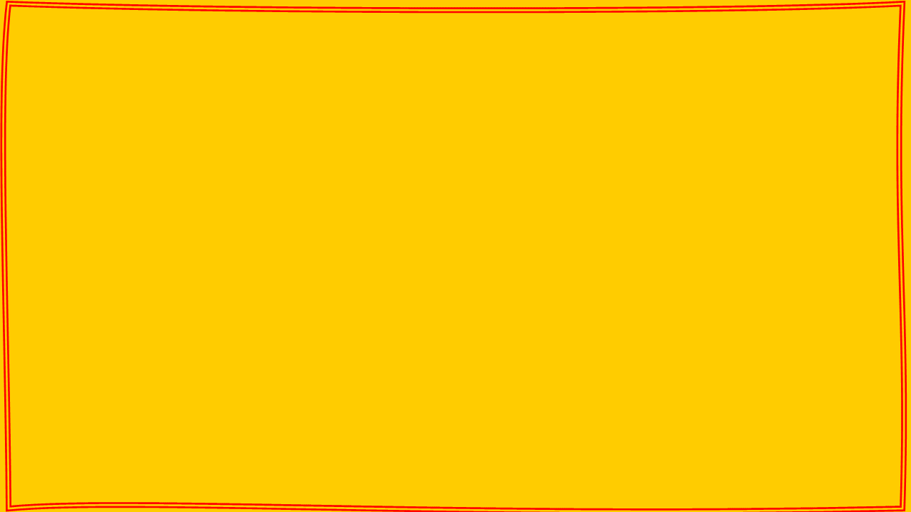

---
output:
  xaringan::moon_reader:
    seal: false
    lib_dir: libs
    css: [default]
    nature:
      highlightStyle: github
      highlightLines: true
      countIncrementalSlides: false

---

class: center, middle
background-image: url(image/amarelo.png)
background-size: 100% 100%
```{css, echo = FALSE}
body {
  color: darkslateblue;
}
```

# Hidráulica Agrícola


---
layout: true
background-image: url(image/branco.png)
background-size: 100% 100%


---
# Introdução

## verificar

### o que é água

Por que estudar hidráulica na agricultura


---

```{r out.width = "50%"}
# url
 
```
---
