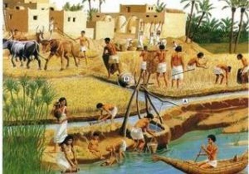
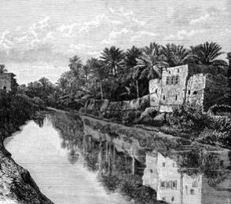
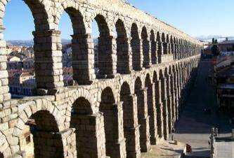
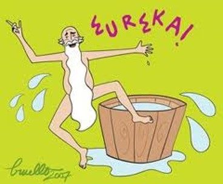
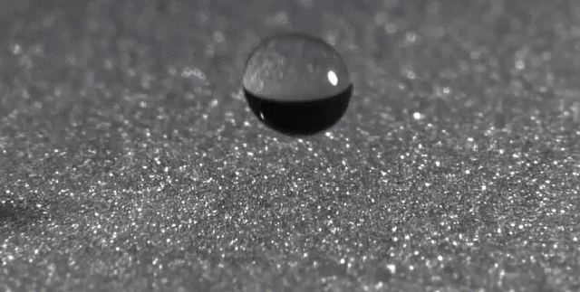
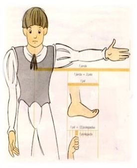
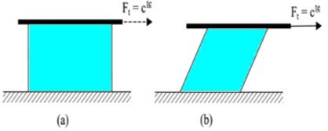

```{r setup, include=FALSE}
knitr::opts_chunk$set(fig.retina = 3, echo = FALSE, out.height = "150px")
```

class: center, middle
background-image: url(image/amarelo.png)
background-size: 100% 100%
```{css, echo = FALSE}
body {
  color: darkslateblue;
}
```


# Hidráulica Agrícola

## Introdução à Hidráulica


---
layout: true
background-image: url(image/branco.png)
background-size: 100% 100%

---
# Introdução à Hidráulica

 A palavra Hidráulica vem do grego *condução de água*:
 
+ *hydor* - água
+ *aulos* - tubo, condução


--

Atualmente o termo Hidráulica tem sentido mais amplo:

> É o estudo do comportamento da água e de outros líquidos, quer em repouso, quer em movimento. 

> Estuda as variáveis que agem sobre os líquidos, como a pressão e a vazão, denre outros.

---

# Introdução à Hidráulica

A Hidráulica pode ser dividida em

* Hidráulica Geral
  * Se aproxima da Mecânica dos Fluidos
  * Trata do entendimento, predição e controle do comportamento dos fluidos
  * Pode ser subdividida em:
    * Hidrostática: fluidos em repouso (estática).
    * Hidrodinâmica: fluidos em movimento (dinâmica).

  

--
* Hidráulica Aplicada
  * Surgiu da necessidade de resolver problemas práticos.
  * Urbana: Sistemas de abastecimento de água, Sistemas de esgoto sanitário, Sistemas de drenagem pluvial.
  * Predial: Indústrias, Comércio, Residências
  * Rural: Sistema de drenagem, Sistema de irrigação
  * Lazer e paisagismo
  * Defesa contra inundações
  * Geração de energia
  * Navegação e obras marítimas e fluviais


---


# História da Hidráulica


.pull-left[
Primeiras obras hidráulicas surgiram na Mesopotâmia e Babilônia

```{r}

```

Primeiro sistema público de abastecimento de água: Aqueduto Jerwan, Assíria 691 a.C.

```{r  }

```

]

.pull-right[
Grandes aquedutos romanos – 312 a.C.

```{r}

```

]

---

# História da Hidráulica

* Princípios da Hidrostática
  * Arquimedes – 250 a.C.
* Século XVI 
  * da Vinci, Stevin, Galileu, Torricelli, Bernoulli, Euler, Venturi
* Século XIX
  * Reynolds, Prandtl, Froude

```{r}

```

---

# Atualmente...

Uso de computadores permitiu a redução do tempo de cálculo

Utilização de modelos de simulação de fenômenos dinâmicos




---
# Dimensões e Sistemas de Unidades

.pull-left[
* Dimensão: Variável física usada para especificar uma característica de um sistema
  * Massa
  * Comprimento
  * Tempo


* Unidade: Quantidade específica de uma dimensão física
  * Algumas unidades de comprimento:
     * Polegada
     * Centímetro
     * Pé
     * Metro
     * Milha
     * Jarda 
  ]
.pull-right[
  
  
]


---
# Sistema Internacional
Conjunto sistematizado e padronizado de definições para unidades de medida, utilizado em quase todo o mundo moderno

As unidades básicas são:
* quilograma (kg-massa)
* metro (m-comprimento) 
* segundo (s-tempo). 

---
class: center, middle

# Algumas unidades SI


|        grandeza       |                 nome                 |     Símbolo     |       Derivação      |
|:---------------------:|:------------------------------------:|:---------------:|:--------------------:|
|     comprimento       |                metro                 |       m         |                      |
|         área          |             metro quadrado           |        m<sup>2</sup>       |                      |
|        volume         |              metro cúbico            |        m<sup>3</sup>       |                      |
|        tempo          |               segundo                |       s         |                      |
|      velocidade       |              metro   segundo         |     m s<sup>-1</sup>     |                      |
|      aceleração       |       metro por segundo quadrado     |     m s<sup>-2</sup>     |                      |
|        massa          |             quilograma               |       kg        |                      |
|        vazão          |        metro cúbico por segundo      |       m<sup>3</sup> s<sup>-1</sup>      |                      |
|        força          |               Newton                 |       N         |     1   kg m s<sup>-2</sup>     |
|       pressão         |               Pascal                 |       Pa        |       1   N m<sup>-2</sup>      |
|       trabalho        |                Joule                 |       J         |        1   N m       |
|       potência        |                Watt                  |       W         |       1   J s<sup>-1</sup>      |

---

# Prefixos do SI

|    10<sup>n</sup> |     Prefixo    |     Símbolo    |             Equivalente decimal            |
|:-----------:|:--------------:|:--------------:|:------------------------------------------:|
|     10<sup>24</sup>    |      yotta     |        Y       |     1 000 000 000 000 000 000 000 000    |
|     10<sup>21</sup>    |      zetta     |        Z       |       1 000 000 000 000 000 000 000      |
|     10<sup>18</sup>    |       exa      |        E       |         1 000 000 000 000 000 000        |
|     10<sup>15</sup>    |       peta     |        P       |           1 000 000 000 000 000          |
|     10<sup>12</sup>    |       tera     |        T       |             1 000 000 000 000            |
|      10<sup>9</sup>    |       giga     |        G       |               1 000 000 000              |
|      10<sup>6</sup>    |       mega     |        M       |                 1 000 000                |
|      10<sup>3</sup>    |      quilo     |        k       |                   1 000                  |
|      10<sup>2</sup>    |      hecto     |        h       |                     100                    |
|      10<sup>1</sup>    |       deca     |        da      |                      10                    |


---
# Prefixos do SI

|    10<sup>n</sup>     |     Prefixo    |      Símbolo    |             Equivalente decimal            |
|:------------:|:--------------:|:---------------:|:------------------------------------------:|
|      10<sup>−1</sup>    |       deci     |         d       |                     0,1                    |
|      10<sup>−2</sup>    |      centi     |         c       |                     0,01                   |
|      10<sup>−3</sup>    |       mili     |         m       |                    0,001                   |
|      10<sup>−6</sup>    |      micro     |     µ   (mu)    |                 0,000 001                |
|      10<sup>−9</sup>    |       nano     |         n       |               0,000 000 001              |
|     10<sup>−12</sup>    |       pico     |         p       |             0,000 000 000 001            |
|     10<sup>−15</sup>    |      femto     |         f       |           0,000 000 000 000 001          |
|     10<sup>−18</sup>    |       atto     |         a       |         0,000 000 000 000 000 001        |
|     10<sup>−21</sup>    |      zepto     |         z       |       0,000 000 000 000 000 000 001      |
|     10<sup>−24</sup>    |      yocto     |         y       |     0,000 000 000 000 000 000 000 001    |

---

# Conversão de Unidades

Dois termos só podem ser equacionados se tiverem a mesma unidade. 

Adição, subtração ou outra operação com dimensões só tem sentido quando suas dimensões forem  idênticas.

---
# Propriedades físicas dos fluidos

Fluidos são substâncias ou corpos cujas moléculas tem a capacidade de se mover (fluir ou escoar).


--

Mais formalmente:

Substâncias que se deformam continuamente quando sob a ação de uma tensão de cisalhamento

```{r}

```

Nossa atenção estará voltada especialmente para a água.

---

# Massa e peso

* Massa – resistência a aceleração
  * Quilograma (kg)
* Peso – força atuante devido a gravidade
  * Newton (N)
  
A segunda Lei de Newton estabelece

.pull-left[

$F = m \cdot a$

* F – força
* m – massa
* a – aceleração
]

.pull-right[

$w = m \cdot g$

* w - peso
*	m - massa
* g – aceleração da gravidade 
* g = 9,81 m s<sup>-2</sup>
]


---

# Massa específica e Peso específico

.pull-left[
* Massa específica: Massa por unidade de volume

$\rho = \frac{m}{vol}$

* Peso específico: Peso por unidade de volume

$\gamma = \frac{w}{vol} = \frac{m \cdot g}{vol}$

* Relação

$\gamma = \rho \cdot g$]

.pull-right[

|     Fluido       |        ρ      |         γ     |
|------------------|:-------------:|:-------------:|
|                  |     kg m<sup>-3</sup>    |      N m<sup>-3</sup>    |
|     Água 4ºC     |      1000     |      9810     |
|     Água 25ºC    |       997     |      9780     |
|     Ar 15ºC      |      1,23     |      12,1     |
|     Mercúrio     |      13 600    |     133 416    |
|     Etanol       |       788     |      7730     |
]


---

# Densidade

Razão entre a massa específica (ρ) do fluido e a massa especifica de uma substância padrão

A água na temperatura de 4ºC é a substância padrão.

$d = \frac{\rho_{substância}}{\rho_{água}}$

|     Fluido         |        d       |
|--------------------|:--------------:|
|     Água   4ºC     |       1,0      |
|     Água   25ºC    |      0,997     |
|     Ar   15ºC      |     0,00123    |
|     Água do mar    |      1,025     |
|     Mercúrio       |       13,6     |
|     Querosene      |      0,820     |
|     Etanol         |      0,788     |
|     Gasolina       |      0,720     |

---

# Exemplos

1. Sabendo que certa substância possui 1500 kg de massa e ocupa um volume de 2 m<sup>3</sup>, determine a massa específica, o peso específico e a densidade dessa substância.

--

2. Um reservatório cilíndrico possui diâmetro de base de 2 m e altura de 4 m. Se o reservatório está cheio de gasolina, determine a massa de gasolina presente no reservatório. Dado: ρ<sub>gasolina</sub> = 720 kg m<sup>-3</sup>.

--

3. A massa da coroa era de 980 g. O volume medido foi de 60,0 mL. Sabendo que a densidade do ouro é 19,3 diga se a coroa era realmente de ouro. 


---

# Viscosidade


.pull-left[
É a propriedade responsável pela resistência ao movimento do fluido. 

* Fluidos "espessos" não escoam com facilidade: 
  * Diesel, glicerina
* Fluidos "finos" escoam com facilidade:
  * Água, etanol
  
* μ – coeficiente de viscosidade dinâmica
  * N s m <sup>-2

* υ  - coeficiente de viscosidade cinemática
  * m <sup>2</sup> s <sup>-1
  
]


.pull-right[

É fortemente influenciada pela temperatura:

|     Temperatura ºC    |     μ (N s m<sup>-2) 10<sup>-6    |     υ (m   s<sup>-1) 10<sup>-9    |
|:---------------------:|:-----------------------:|:------------------------:|
|            0          |           1791          |            1792          |
|            2          |           1674          |            1673          |
|            4          |           1566          |            1567          |
|           10          |           1308          |            1308          |
|           15          |           1144          |            1146          |
|           20          |           1008          |            1007          |
|           40          |            653          |            657           |
|           60          |            469          |            478           |
|           90          |            317          |            328           |
|           100         |            284          |            296           |
]


---

# Pressão de vapor

Dependendo da pressão a que está submetido, um líquido entra em ebulição a determinada temperatura. 

Variando a pressão varia também a temperatura de ebulição. 

Esta propriedade é fundamental na análise do fenômeno da cavitação, pois quando um líquido inicia a ebulição inicia-se também a cavitação.

|     Temperatura ºC    |     Pressão de vapor (kgf cm<sup>-2)    |     Temperatura ºC    |     Pressão de vapor (kgf cm<sup>-2)    |
|:---------------------:|:----------------------------------:|:---------------------:|:----------------------------------:|
|            1          |               0,00669              |           50          |                0,1258              |
|            5          |               0,00889              |           60          |                0,2031              |
|           10          |               0,01251              |           65          |                0,2550              |
|           15          |               0,01737              |           70          |                0,3178              |
|           20          |               0,02383              |           75          |                0,3931              |
|           25          |               0,03229              |           80          |                0,4829              |
|           35          |               0,05733              |           90          |                0,7194              |
|           45          |               0,09771              |           100         |                1,0332              |

