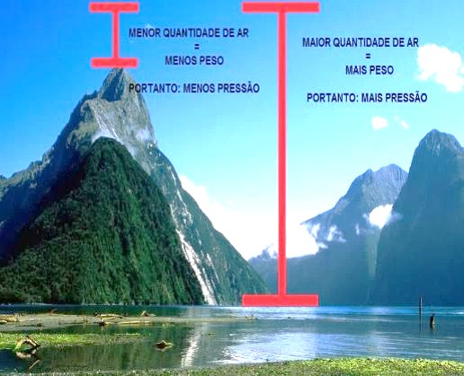
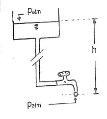
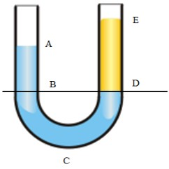
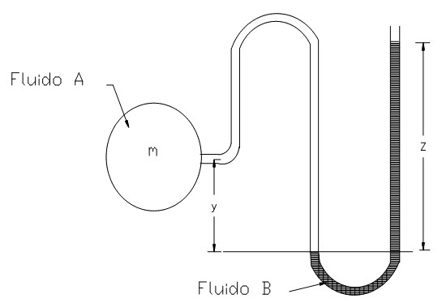
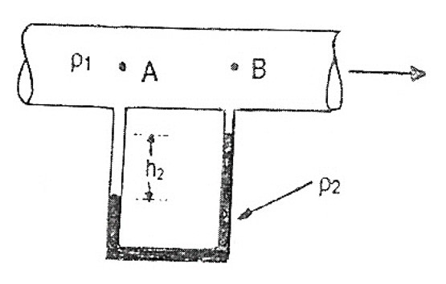

```{r setup, include=FALSE}
knitr::opts_chunk$set(fig.retina = 3, echo = FALSE, out.height = "150px")
```

class: center, middle
background-image: url(image/amarelo.png)
background-size: 100% 100%
```{css, echo = FALSE}
body {
  color: darkslateblue;
}
```


# Hidráulica Agrícola

## Hidrostática


---
layout: true
background-image: url(image/branco.png)
background-size: 100% 100%

---
# Pressão

Relaciona uma força à unidade de área

$P=\frac{F}{A}$


Unidades: 	
* Pascal (Pa) que equivale a uma força de 1 N sobre uma área de 1 m<sup>2</sup> 
* 1 Pa = 1 N m<sup>-2</sup>
* kgf m<sup>-2</sup>, kgf cm<sup>-2</sup>, bar, mca, mmHg


---

# Escala de pressão


* Pressão absoluta

Quando a pressão é expressa como sendo a diferença entre seu valor medido e o vácuo absoluto

* Pressão relativa

Quando a pressão é expressa como sendo a diferença entre seu valor medido e a pressão atmosférica local
Também chamada pressão manométrica ou pressão efetiva

P<sub>absoluta</sub> = P<sub>relativa</sub> + P<sub>atmosferica</sub>


---

# O que causou isso?

<iframe width="560" height="315" src="https://www.youtube-nocookie.com/embed/jRkFbij2MgU" title="YouTube video player" frameborder="0" allow="accelerometer; autoplay; clipboard-write; encrypted-media; gyroscope; picture-in-picture; web-share" allowfullscreen></iframe>

---

# Pressão atmosférica

Pressão atmosférica é a pressão exercida pela camada de moléculas de ar sobre a superfície.

<iframe width="560" height="315" src="https://www.youtube-nocookie.com/embed/XqrrBuKfNWM" title="YouTube video player" frameborder="0" allow="accelerometer; autoplay; clipboard-write; encrypted-media; gyroscope; picture-in-picture; web-share" allowfullscreen></iframe>

---


---

# Pressão atmosférica


.pull-left[
A pressão atmosférica varia com a altitude

$P_{atm} = 10,33 - 0,001 \cdot h$

em que h = altitude, m

]

.pull-right[

]

???


--
 A pressão atmosférica agindo igualmente em todos os pontos, muitas vezes não precisa ser considerada.

---

# Lei de Pascal

Em qualquer ponto no interior de um líquido em repouso, a pressão é a mesma em todas as direções.

Qualquer alteração na pressão aplicada a um pequeno volume de um fluido confinado e incompressível é transmitida integralmente a todos os pontos do fluido, bem como às paredes do recipiente que o mantém confinado. 

---

# Elevador Hidráulico

.pull-left[

]


.pull-right[
$F_2 = F_1 \cdot \frac{A_2}{A_1}$
]

---

# Exemplo

Qual a força resultante no êmbolo maior cujo diâmetro é de 75 cm se a força aplicada no embolo menor, cujo diâmetro é de 25 cm, for de 200 N?

.pull-left[

]

--

.pull-right[
$F_2 = 200 \cdot \frac{75^2}{25^2} = 1800 N$
]

---

# Lei de Stevin

Princípio fundamental da Hidrostática


> A diferença de pressões entre dois pontos da massa de um líquido em equilíbrio é igual à diferença de profundidade multiplicada pelo peso específico do líquido.

$$
P_2 - P_1 = \gamma \cdot h
$$


---

# Exemplo

Qual a pressão na torneira, ao nível do mar, considerando a altura h=3,2 m? Descreva os efeitos da pressão atmosférica.



--

Considerando um ponto A na superfície da água na caixa d’água e um ponto B na saída da torneira, em ambos atuando a pressão atmosférica:

$$
P_t = 9810 \cdot 3,2 = 31 392 Pa = 31,4 kPa 
$$

A pressão atmosférica atua em todos os pontos do sistema, anulando o seu efeito. Para uma diferença de cotas de 3,2 m, a diferença de pressão atmosférica é desprezível.


---

# Exemplo

Seja o líquido azul água (γ=9810 N m<sup>-3</sup>) e o líquido amarelo etanol (γ= 7730 N m<sup>-3</sup>). 

Calcule as pressões relativas que atuam em todos os pontos do sistema. 

Dados: 

* altura AB = 12,419 cm
* altura BC = CD = 21,100 cm
* altura DE = 15,761 cm



???

𝑃_𝐴=𝑃_𝑎𝑡𝑚=0 

𝑃_𝐵=𝛾_𝑎𝑔𝑢𝑎.ℎ_𝐴𝐵=9810 . 0,12419=1218,3 𝑃𝑎 

𝑃_𝐶=𝛾_𝑎𝑔𝑢𝑎.ℎ_𝐴𝐶=9810 . (0,12419+0,21100)=3288,2 𝑃𝑎 

𝑃_𝐷=𝛾_𝑎𝑔𝑢𝑎.ℎ_𝐸𝐷=7730 . 0,15761=1218,3 𝑃𝑎 

𝑃_𝐸=𝑃_𝑎𝑡𝑚=0 

Os pontos B e D estão localizados a mesma altura e no mesmo fluido (água), logo, a pressão nestes dois pontos deve ser igual.


---

# Pressão em termos de altura de coluna de um fluido

Forma conveniente de expressar a pressão
A pressão se confunde com a profundidade

$$
h = \frac{P}{\gamma}
$$

* h - pressão em termos de altura de coluna de fluido, metros
* P - pressão, N m<sup>-2
* γ - peso específico, N m<sup>-3

No caso da água, se denomina metro de coluna de água (mca)

---

# Medida das pressões

Manometria – ação de medir pressões

Manômetros – aparelhos que medem pressão

* Piezômetros
* Tubo em U
* Manômetros diferenciais
* Manômetros metálicos
* Manômetros digitais

---

# Piezômetros

.pull-left[

]


.pull-right[
Também chamado de tubo piezométrico, é um tubo transparente inserido na canalização.
O líquido sobe até uma altura *h* dentro do piezômetro.

]

---

# Tubo em U

.pull-left[

]

.pull-right[
Aplicado para medir pressões muito pequenas ou demasiadamente grandes para os piezômetros.

Utiliza em líquido manométrico:
* Pequenas pressões: água, tetracloreto de carbono, tetrabrometo de acetileno e benzina 
* Grandes pressões: mercúrio

]

$$
P = \gamma ' \cdot h - \gamma \cdot z
$$

ou

$$
P = d ' \cdot h - d \cdot z
$$

---

# Exemplo

Calcular a pressão em "m", quando o fluido A for água, o fluido B tetracloreto de carbono (d=1,5), e as alturas z=559 mm e y=300 mm.


.pull-left[

]


???
𝑃_𝑚+0,3 . 1,0=0,559 . 1,5=0,5385 𝑚𝑐𝑎

---
# Exemplo

Determine a pressão no ponto A quando h<sub>1</sub> = 20 cm e h<sub>2</sub> = 60 cm. O líquido manométrico é o mercúrio (ρ = 13600 kg m<sup>-3</sup>). 


???
𝑃_𝐴+0,2 . 1=0,6 . 13,6
𝑃_𝐴=7,96 𝑚𝑐𝑎  

---

# Manômetro diferencial


.pull-left[
Para determinação da diferença de pressão, empregam se manômetro diferenciais


]


.pull-rigth[

$P_2 - P_1 = \Delta P = h \cdot \gamma ' - h \cdot \gamma$

$P_2 - P_1 = \Delta P = h \cdot d ' - h \cdot d$
]


---

# Exemplo

Determinar a diferença de pressão entre dois pontos A e B distantes entre si 50 cm sendo a altura h<sub>2</sub>=33 cm e o líquido manométrico mercúrio.

.pull-left[


]

???
Δ𝑃= (13,6−1)  .  0,33
Δ𝑃 =4,15 𝑚𝑐𝑎

---

# Manômetros metálicos e digitais

Atualmente, são os mais utilizados na agricultura para medir as pressões manométricas, tanto positivas quanto negativas.

São instalados diretamente no ponto em que se deseja efetuar a leitura da pressão.

.pull-left[

]


.pull-right[

]
