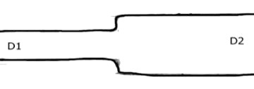
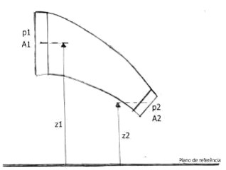
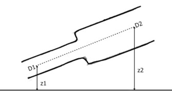
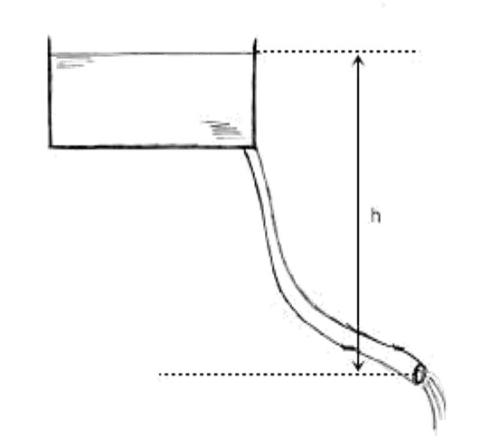

```{r setup, include=FALSE}
knitr::opts_chunk$set(fig.retina = 3, echo = FALSE, out.height = "150px")
```

class: center, middle
background-image: url(image/amarelo.png)
background-size: 100% 100%
```{css, echo = FALSE}
body {
  color: darkslateblue;
}
```


# Hidráulica Agrícola

## Hidrodinâmica


---
layout: true
background-image: url(image/branco.png)
background-size: 100% 100%

---


# Hidrodinâmica

Tem por objetivo o estudo do movimento dos fluidos

Inicialmente consideremos um fluido perfeito

* Não possui viscosidade
* Incompressível
* Massa específica constante
* Não apresenta atrito interno


---
# Vazão

Volume de líquido que atravessa uma seção por unidade de tempo.

* No SI - m<sup>3</sup>/s
* L/s; L/h; m<sup>3</sup>/h

--

$Q =  A \cdot V$

> A vazão pode ser calculada como a multiplicação da velocidade de um fluido pela área da seção transversal que ele atravessa.

???
Q=Vol/t

Q=área*s/t

Q=A*V

---

# Exemplos

* Calcular a vazão que flui a uma velocidade de 2 m.s<sup>-1</sup> em uma tubulação de 50 mm de diâmetro. Dar a resposta em m<sup>3</sup>.s<sup>-1</sup>, m<sup>3</sup>.h<sup>-1</sup>, L.s<sup>-1</sup> e L.h<sup>-1</sup>.

--

* Por uma tubulação cujos tubos possuem 100 mm de diâmetro, circulam 6 L/s de água. Qual a velocidade média de escoamento da água na tubulação?

--

* Em um projeto determinou-se que a vazão necessária é de 32 m<sup>3</sup>.h<sup>-1</sup>. Qual deve ser o diâmetro mínimo do tubo para que a velocidade da água não ultrapasse 2 m/s?

???
Calcular a vazão que flui a uma velocidade de 2 m.s-1 em uma tubulação de 50 mm de diâmetro. Dar a resposta em m3.s-1, m3.h-1, L.s-1 e L.h-1.
𝑄=((𝜋 . 〖0,05〗^2)/4)  2,0=0,0039 𝑚^3.𝑠^(−1)=14,04〖 𝑚〗^3.ℎ^(−1)=3,9 𝐿.𝑠^(−1)=14040 𝐿 .ℎ^(−1) 
Por uma tubulação cujos tubos possuem 100 mm de diâmetro, circulam 6 L/s de água. Qual a velocidade média de escoamento da água na tubulação?
𝑉=𝑄/𝐴=0,006/(((𝜋 .  〖0,1〗^2)/4) )=0,76 𝑚 . 𝑠^(−1) 
Em um projeto determinou-se que a vazão necessária é de 32 m3.h-1. Qual deve ser o diâmetro mínimo do tubo para que a velocidade da água não ultrapasse 2 m/s?
𝐷=√((4 . 𝑄)/(𝜋 . 𝑉))=√((4 . (32/3600))/(𝜋 . 2))=0,075 𝑚=75 𝑚𝑚 

---

# Equação da continuidade

Relaciona a velocidade média de escoamento com a área de deslocamento

* Fluxo permanente: dm/dt=0
* Liquido incompressível: ρ constante


$Q = A_1 \cdot V_1 =  A_2 \cdot V_2 = ... =A_n \cdot V_n$

--


---

# Exemplo

A tubulação representada na figura abaixo é composta de 2 trechos de diâmetros diferentes, D1=75 mm e D2=150 mm. A vazão é de 55 L/s. Determinar a velocidade média de escoamento da água nos 2 trechos.



???
𝑉_1=𝑄/𝐴_1 =0,055/(((𝜋 . 〖0,075〗^2)/4) )=12,45 𝑚 . 𝑠^(−1) 
𝐴_1.𝑉_1=𝐴_2.𝑉_2→(𝜋.〖0,075〗^2)/4.12,45=(𝜋.〖0,150〗^2)/4.𝑉_2→𝑉_2=3,11 𝑚.𝑠^(−1) 

---

# Teorema de Bernoulli para fluidos perfeitos


.pull-left[
Resulta da aplicação do princípio da conservação da energia.

$\frac{P_1}{\gamma} + \frac{V_1^2}{2 \cdot g} + z_1 = \frac{P_2}{\gamma} + \frac{V_2^2}{2 \cdot g} + z_2 = constante$

> No escoamento permanente de um fluido perfeito, a soma das alturas piezométricas (P/γ), cinética (V<sup>2</sup>/2g) e geométrica (z) ao longo da linha de corrente se mantém constante.


]

.pull-right[


```{r}

```


* Energia de pressão (P/γ): representa a quantidade de trabalho necessária a movimentação do fluido contra a pressão reinante no sistema.
* Energia cinética (V<sup>2</sup>/2g): está associada a velocidade de escoamento do fluido no conduto.
* Energia gravitacional (g): está associada a posição da massa fluida em relação a um referencial de posição.

]

---

# Exemplos 

Uma tubulação é constituída de 2 trechos de D1=200 mm e D2=250 mm. Sabendo que a pressão manométrica no ponto 1 é de 1,5 kgf.cm<sup>-2</sup>, que a velocidade da água neste mesmo trecho é de 0,60 m.s<sup>-1</sup>, e z1=10 m e z2=20 m, determinar (a) vazão na tubulação e (b) pressão no ponto 2.



???
𝑄=𝐴.𝑉=(𝜋 . 〖0,2〗^2)/4.0,6=0,0188 𝑚^3.𝑠^(−1)=18,8 𝐿.𝑠^(−1) 
𝐴_1.𝑉_1=𝐴_2.𝑉_2→(𝜋.〖0,2〗^2)/4.0,6=(𝜋.〖0,25〗^2)/4.𝑉_2→𝑉_2=0,38 𝑚.𝑠^(−1) 
 
𝑃_1/𝛾+(𝑉_1^2)/(2.𝑔)+𝑍_(1=)  𝑃_2/𝛾+(𝑉_2^2)/(2.𝑔)+𝑍_2 
(1,5 . 10^4)/1000+(〖0,6〗_^2)/2.9,81+10=𝑃_2/𝛾+(〖0,38〗_^2)/2.9,81+20 
𝑃_2/𝛾=5,0 𝑚𝑐𝑎=5000 𝑘𝑔𝑓.𝑚^(−2) 


---

# Exemplo

Sendo a altura h=3 m, qual a vazão na mangueira? (diâmetro = 20 mm)




???
𝑃_1/𝛾+(𝑉_1^2)/(2.𝑔)+𝑍_(1=)  𝑃_2/𝛾+(𝑉_2^2)/(2.𝑔)+𝑍_2 
0+0+3=0+(𝑉_2^2)/(2.𝑔)+0→𝑉_2´=7,67 𝑚 . 𝑠^(−1) 
𝑄=𝐴.𝑉=(𝜋 . 〖0,02〗^2)/4.7,67=0,0024 𝑚^3.𝑠^(−1)=2,4 𝐿.𝑠^(−1) 

---

# Aplicações práticas do teorema de Bernoulli

## Tubo de Venturi

## Tubo de Pitot

---

# Tubo de Venturi

Consiste de seção convergente gradual, seguida de um estrangulamento (garganta) e de uma seção divergente gradual. 

```{r}
knitr::include_graphics("https://hidraulica.tolentino.pro.br/images/4-venturi.png")
```

No estrangulamento, observa-se uma diminuição da pressão devido ao aumento da velocidade.

---
# Tubo de Venturi

Aplicações:

* carburadores de carro
* aerógrafos para pintura
* injetor de fertilizantes
* medido de vazão em tubulações

---

# Tubo de Venturi como medidor de vazão

```{r}
knitr::include_graphics("https://hidraulica.tolentino.pro.br/images/4-venturi-vazao.png")
```

$$
Q = \frac{\pi \cdot D_1^2}{4} \cdot \sqrt{\frac{2 \cdot g \cdot \Delta P}{(\frac{D_1}{D_2})^4-1}}
$$

---

# Exemplo

Qual a vazão que escoa por uma tubulação de 50 mm de diâmetro em que está instalado um Venturi com 25 mm no estrangulamento. O sistema está ligado a um manômetro diferencial de mercúrio, cuja deflexão na coluna de mercúrio é de 45 cm.

???

DP = (13,6-1) * 0,45 = 5,67 mca

Q = pi * 0,050^2/4 * raiz 19,62*5,67 / (0,050/0,025)^4-1 = 0,00537 m3/s = 5,37 L/s

---

# Tubo de Pitot

Consiste de dois tubos concêntricos de pequeno diâmetro. O tubo interno mede a energia total de escoamento, enquanto que o tubo externo mede unicamente a energia de pressão estática. A diferença entre o tubo interno e externo corresponde à carga cinética, ou seja, a energia de velocidade.

```{r}
knitr::include_graphics("https://hidraulica.tolentino.pro.br/images/4_pitot.png")
```

Quando um tubo de Pitot é ligado a um manômetro diferencial, a velocidade da água escoando é calculada pela equação

$$
V = \sqrt{2 \cdot g \cdot h \cdot (D_{man}-D_a)}
$$

---

# Tubo de Pitot

Tubos de Pitot são utilizados na aviação para medir a altitude e velocidade no ar dos aviões. Equipam desde pequenos monomotores até grandes jatos

```{r, fig.cap="Tubo de Pitot em aviões: Cessna 172 Skyhawk II (acima) e Boeing 777-381 (abaixo)", out.height="350px"}
knitr::include_graphics("https://hidraulica.tolentino.pro.br/images/4_pitot_aviao.png")
```

---
class: middle
background-image: url(https://img.freepik.com/free-photo/abstract-luxury-plain-blur-grey-black-gradient-used-as-background-studio-wall-display-your-products_1258-63749.jpg?w=2000
background-size: 100% 100%


# O voo Air France 447

Em 31 de maio de 2009, o voo 447 da Air France que fazia a rota Rio de Janeiro - Paris caiu no Ocenao Atlântico com 228 pessoas a bordo. 

O relatório final da investigação do acidente apontou que a tragédia foi causada por uma combinação de erros de avaliação dos pilotos devido a problemas técnicos ocorridos por congelamento nos sensores de velocidade (tubo de Pitot). Segundo o relatório as sondas Pitot, obstruídas por cristais de gelo, não conseguiram informar a velocidade correta da aeronave, o que causou a desconexão do piloto automático e em seguida diversos erros de avaliação dos pilotos.

---

# Exemplo

Um tubo de Pitot foi instalado no centro de uma tubulação de 200 mm de diâmetro que está conduzindo água. Se a deflexão da coluna de mercúrio é de 264 mm, calcular a vazão conduzida pela tubulação.

???
V = raiz( 19,62 * 0,264 * 13,6-1) = 8,08 m/s
Q = pi D^2/4*V = 0,25 m3?s = 250 L/s
---


