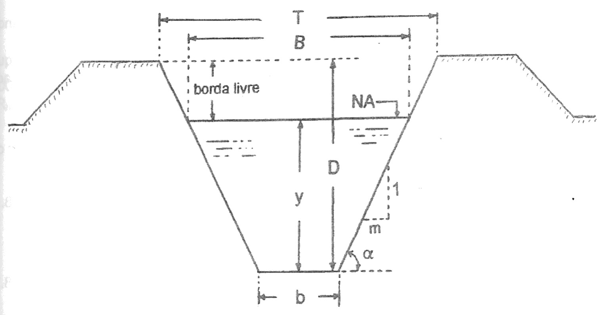
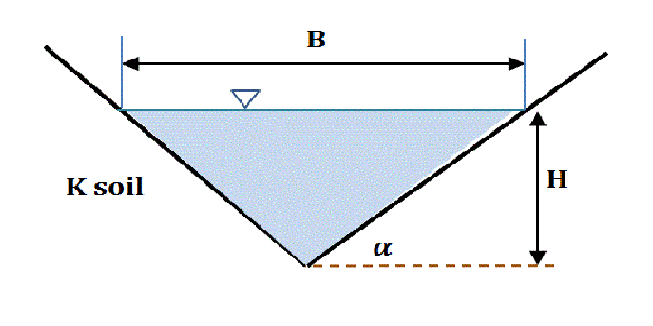
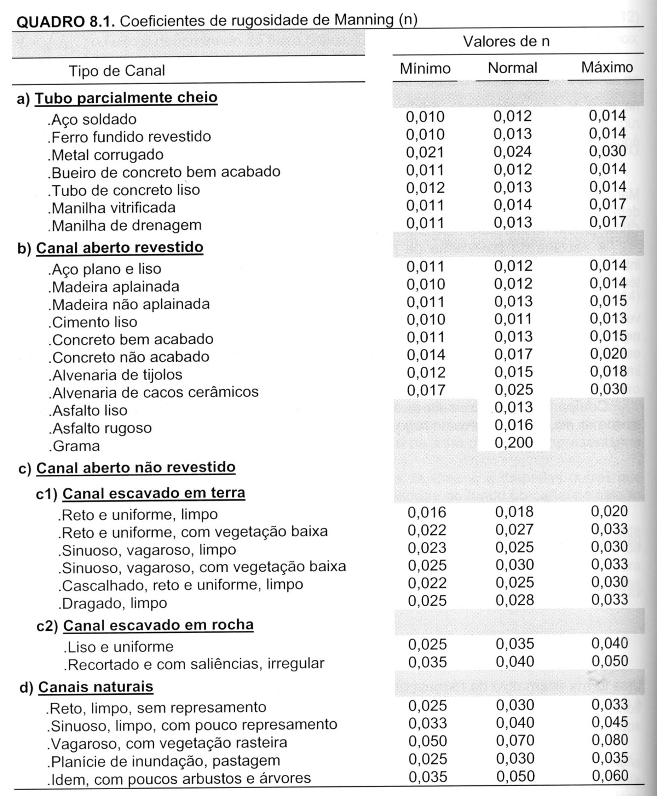

```{r setup, include=FALSE}
knitr::opts_chunk$set(fig.retina = 3, echo = FALSE, out.height = "150px")
```

class: center, middle
background-image: url(image/amarelo.png)
background-size: 100% 100%
```{css, echo = FALSE}
body {
  color: darkslateblue;
}
```


# Hidráulica Agrícola

## Condutos Livres


---
layout: true
background-image: url(image/branco.png)
background-size: 100% 100%

---


# Condutos Livres

O escoamento da água em um conduto livre ou canal tem como característica principal o fato dele apresentar uma superfície livre, sobre a qual atua a pressão atmosférica. 

Rios, canais, drenos e calhas são exemplos típicos de condutos livres de seção aberta. 

Os tubos, embora sejam condutos de seção fechada, também funcionam como condutos livres quando estão operando parcialmente cheios, como é o caso de galerias pluviais e dos bueiros.

---


# Elementos geométricos de um canal

.pull-left[

* y - profundidade de escoamento
* b - largura do fundo do canal
* α – inclinação do talude
* m – cotangente do ângulo α
]

.pull-right[

```{r, out.height="200px"}

```
]


---

# Elementos geométricos de um canal

.pull-left[
* Seção molhada (A): é a parte da seção transversal do canal que é totalmente ocupada pela água.
* Perímetro molhado (P): corresponde a soma dos comprimentos relativos ao fundo e aos taludes do canal que estão em contato direto com a água.
* Raio hidráulico (RH): é a razão entre a seção molhada e o perímetro molhado do canal. O raio hidráulico é a dimensão característica dos canais abertos, assim como o diâmetro interno dos tubos o é para os condutos forçados.


]

.pull-right[

```{r, out.height="200px"}

```
]


---
 
# Formas geométricas mais utilizadas em canais

## Trapezoidal


.pull-left[
```{r}
knitr::include_graphics("https://upload.wikimedia.org/wikipedia/commons/2/2f/Trapezoidal_artificial_water_channel.png")
```
]

.pull-right[
É um formato bstante popular pela sua eficiência, pela relação entre área molhada e perímetro molhada ser grande e pelos seus taludes serem adequados para construção de canais em terra, uma vez que seus ângulos podem ser ajustados para terem estabilidade

* Seção molhada
$A=y \cdot (b+m \cdot y)$

* Perímetro molhado
$P=b+2 \cdot y \cdot \sqrt{1+m^2}$

]
---
# Formas geométricas mais utilizadas em canais

## Retangular


.pull-left[

```{r}
knitr::include_graphics("http://raimondi.com.br/wp-content/uploads/2017/03/WhatsApp-Image-2021-05-15-at-09.38.37.jpeg")
```


]

.pull-right[
É um caso especial de um canal trapezoidal no qual o ângulo de inclinação dos taludes é 90°. Os canais de concreto armado são construídos com seção de escoamento retangular.

* Seção molhada
$A=y \cdot b$

* Perímetro molhado
$P=b+2 \cdot y$
]
---

# Formas geométricas mais utilizadas em canais

## Triangular


.pull-left[

```{r}

```

]

.pull-right[

Também é um caso especial do canal trapezoidal no qual a largura do fundo do canal é nula (b=0).  Os sulcos de infiltração geralmente são abertos com seção triangular.

* Seção molhada
$A=m \cdot y^2$𝐴=𝑚𝑦^2

* Perímetro molhado
$P=2 \cdot y\cdot \sqrt{1+m^2}$

]
---

# Fórmula de Manning

É utilizada para dimensionamento de canais em escoamento permanente uniforme, sendo escrita como:

$Q = \frac{1}{n} \cdot A \cdot Rh^{2/3} \cdot i^{1/2}$


* Q – vazão de escoamento, m<sup>3</sup>/s
* n – coeficiente de rugosidade de Manning
* A – área molhada, m<sup>2</sup>
* Rh - raio hidráulico, m
* i – declividade da linha de energia, m/m

---




---

# Exemplo

Determinar a vazão de um canal trapezoidal com as seguintes características: 

* Inclinação dos taludes: 1(vertical):1,5(horizontal)
* Declividade do canal: 1 m em 1500 m
* Largura do fundo (b): 3,5 m
* Profundidade de escoamento (y): 1,2 m

Considerar duas situações: 

a) canal de paredes de terra reto, limpo e uniforme; 

b) canal com paredes revestidas de concreto bem acabado.

???
𝐴=𝑦(𝑏+𝑚𝑦)=1,2(3,5+1,5∙1,2)=6,36𝑚^2 
𝑃=𝑏+2𝑦√(1+𝑚^2 )=3,5+2∙1,2√(1+〖1,5〗^2 )=7,83𝑚 
𝑅ℎ=𝐴∕〖𝑃=6,36∕〖7,83=0,81𝑚〗〗   
a) 𝑄=1/𝑛∙𝐴∙〖𝑅ℎ〗^(2⁄3)∙𝑖^(1⁄2) =1/0,018∙6,36∙〖0,81〗^(2⁄3)∙(1∕1500)^(1⁄2)=7,93𝑚^3/𝑠
b) 𝑄=1/𝑛∙𝐴∙〖𝑅ℎ〗^(2⁄3)∙𝑖^(1⁄2) =1/0,013∙6,36∙〖0,81〗^(2⁄3)∙(1∕1500)^(1⁄2)=10,97𝑚^3/𝑠


#
---

# Exemplo

Determinar a declividade que deve ser dada a um canal para atender as seguintes condições de um projeto: 

* Vazão (Q): 2,0 m3/s
* Profundidade de escoamento (y): 0,80 m
* Largura do fundo (b): 2,0 m
* Paredes revestidas de concreto bem acabado

???
𝐴=𝑦𝑏=0,8∙2=1,6𝑚^2 
𝑃=𝑏+2𝑦=2+2∙0,8=3,6𝑚 
𝑅ℎ=𝐴∕〖𝑃=1,6∕〖3,6=0,44𝑚〗〗   
𝑄=1/𝑛∙𝐴∙〖𝑅ℎ〗^(2⁄3)∙𝑖^(1⁄2)→2=1/0,013∙1,6∙〖0,44〗^(2⁄3)∙𝑖^(1⁄2)→𝑖=0,000789𝑚/𝑚 


---

# Exemplo 

Um canal escavado em terra com seção trapezoidal tem coeficiente de rugosidade n=0,020. Determinar sua profundidade de escoamento (y) considerando-se as seguintes condições de projeto:

* Vazão (Q): 6,5 m3/s
* Largura do fundo (b): 4,0 m
* Inclinação dos taludes: 1:1,5
* Declividade (i): 0,65%

???
tentativas	y (m)	A (m2)	P (m)	RH (m)	Q (m3/s)	
	1,0	5,5	7,61	0,723	17,90	↓
	0,3	1,34	5,08	0,263	2,23	↑
	0,6	2,94	6,16	0,477	7,27	↓
	0,5	2,38	5,80	0,409	5,31	↑
	0,562	2,72	6,03	0,452	6,50	ok


