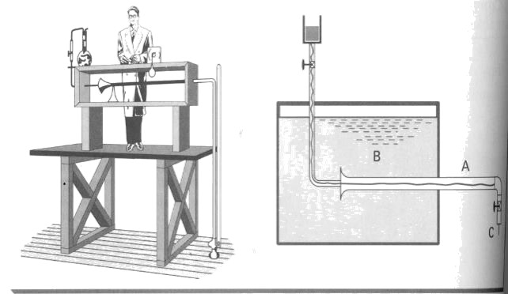

```{r setup, include=FALSE}
knitr::opts_chunk$set(fig.retina = 3, echo = FALSE, out.height = "150px")
```

class: center, middle
background-image: url(image/amarelo.png)
background-size: 100% 100%
```{css, echo = FALSE}
body {
  color: darkslateblue;
}
```


# Hidráulica Agrícola

## Regimes de escoamento


---
layout: true
background-image: url(image/branco.png)
background-size: 100% 100%

---


# Experiência de Reynolds 

Osborne Reynolds realizou uma experiência, em 1883, que pode ser considerada uma das mais importantes da história da hidráulica.
 
A experiência de Reynolds demonstrou a existência de dois tipos de escoamentos: o laminar e o turbulento.


```{r, out.height = "330px"}

```

---

# Regimes de escoamento

Abrindo-se gradualmente a torneira, inicalmente, o regime é do tipo laminar: as trajetórias das partículas em movimento são bem definidas e não se cruzam.

Abrindo-se mais a torneira, aumentado a velocidade de escoamento até a  velocidade crítica superior, inicia o regime turbulento: caracteriza-se pelo movimento desordenado das partículas.

Revertendo-se o processo (fechando a torneira), diminuindo a velocidade de escoamento até a  velocidade crítica inferior, o regime volta a ser laminar.

```{r, out.height="300px"}
knitr::include_graphics("https://hidraulica.tolentino.pro.br/images/4_reynolds.png")
```

---

```{r}
knitr::include_url("https://www.youtube.com/embed/nAc5UDpH-KE")
```

---

# Número de Reynolds


.pull-left[
Adimensional utilizado para determinar regime de escoamento


$$
Re=\frac{V \cdot D}{\nu}
$$

* Re – número de Reynolds, adimensional
* V – velocidade, m/s
* D – diâmetro, m
* υ – viscosidade cinemática, m<sup>2</sup>/s

]

.pull-right[

Critérios:

* Re < 2000 – movimento laminar

* Re > 4000 -  movimento é turbulento

* 2000 < Re < 4000 – zona de transição em que não é possível determinar o regime.
]

---

# Exemplos 

Por uma tubulação de 100 mm de diâmetro escoa água com uma velocidade média de 2,0 m/s. Determinar o regime de escoamento, dados: υ=1,01x10<sup>-6</sup> m<sup>2</sup>/s.

--

Na mesma tubulação é escoado óleo combustível (υ=1,20x10<sup>-4</sup>m<sup>2</sup>/s). Qual será o regime de escoamento?

???

𝑅𝑒=(2∙0,1)/(1,01∙10^(−6) )=198019 →𝑡𝑢𝑟𝑏𝑢𝑙𝑒𝑛𝑡𝑜 

𝑅𝑒=(2∙0,1)/(1,2∙10^(−4) )=1666 →𝑙𝑎𝑚𝑖𝑛𝑎𝑟 


---

